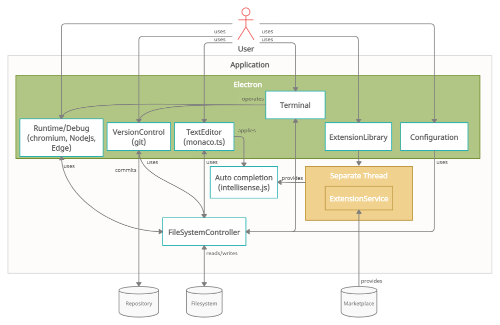
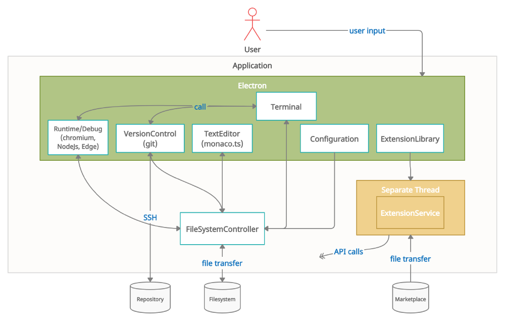

# My_ide

## Project Goals

Develop a cross platform ide capable of running on mac, windows, linux, and the browser.

## Features

- Create, open, and edit text files
- Display text
- Syntax highlighting
- Theme editing
- Compile and run programs
- Support to multiple languages
- Environment management
- Debugging tools
	- Break points
	- Stack Explorer
	- Symbols Explorer
	- Error highlighter
- Code management tools
	- Symbol editing
	- File Explorer
- Multi-plataform
- Plugin system
- Git integration

## Research

### [VS Code Wiki](https://github.com/microsoft/vscode/wiki)

###  [The craft of text editing book](https://www.finseth.com/craft/craft.pdf)

### [Software Documentation](https://www.workingsoftware.dev/software-architecture-documentation-the-ultimate-guide/)

### [vscode architecture](https://dev.to/ninglo/vscode-architecture-analysis-electron-project-cross-platform-best-practices-g2j)

### [Design Patterns]

### [VSCode - From Vision to Architecture](https://2021.desosa.nl/projects/vscode/posts/essay2/)

[...] the project takes both a layered as well as a modular approach to software architecture for the core package. This core package is built to be extended using the Extension API to provide nearly all features that exist in VSCode.

### [VS Code Source Code organization Wiki](https://github.com/microsoft/vscode/wiki/Source-Code-Organization)

### [The History of Visual Studio Code](https://www.youtube.com/watch?v=Tw8l0WzQxmY)

### [VS Code Editor Design Doc](https://github.com/microsoft/vscode/wiki/%5BWIP%5D-Code-Editor-Design-Doc)

Fenomenal guidance for the architectural desicions behind vs code

### [VS Code Extension samples](https://github.com/Microsoft/vscode-extension-samples)

### [VSCode language server protocol](https://microsoft.github.io/language-server-protocol/)

### [Extension API guidelines](https://github.com/microsoft/vscode/wiki/Extension-API-guidelines)

### [VS Code File watcher](https://github.com/microsoft/vscode/wiki/File-Watcher-Internals)

### [VS Code Source Code Organization](https://github.com/microsoft/vscode/wiki/Source-Code-Organization)
